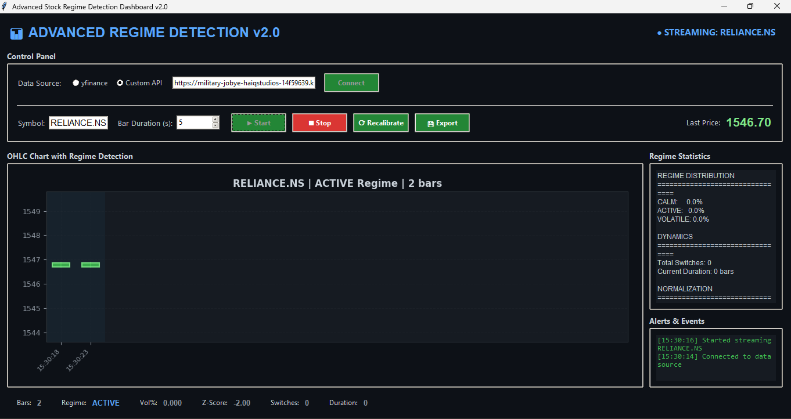

# Market Regime Detector 📊

**Advanced Stock Market Regime Detection Dashboard v2.0**

This dashboard provides real-time visualization and analysis of stock market regimes using a robust, multi-factor detection model. It helps traders and analysts identify periods of calm, active trading, and high volatility, enabling more informed decision-making.



## Features

- **Real-time Data Streaming:** Connects to `yfinance` or a custom API for live price updates.
- **Robust Regime Detection:** Employs a sophisticated model considering volatility, momentum, and trend strength with adaptive thresholds.
  - **Regimes:** CALM, ACTIVE, VOLATILE
- **Interactive OHLC Charting:** Visualizes price action with candlestick charts, overlaid with regime-specific background colors.
- **Live Statistics:** Displays current price, regime status, volatility, and historical regime distribution.
- **Customizable Timeframes:** Set the duration for each OHLC bar (e.g., 5 seconds, 1 minute).
- **Data Export:** Save historical bar data and statistics to JSON format.
- **Calibration & Recalibration:** Automatically calibrates the detection model and allows manual recalibration.
- **Alerts:** Logs significant events like regime shifts and connection status.
- **Dark Theme UI:** Modern, eye-friendly interface.

## Technologies Used

- **Python:** 3.x
- **Libraries:**
  - `tkinter` for the GUI
  - `numpy` for numerical operations
  - `pandas` for data handling (especially with yfinance)
  - `matplotlib` for charting
  - `requests` for API communication
  - `scipy` for statistical functions
  - `yfinance` for fetching stock data (optional)

## Installation

1.  **Clone the repository:**

    ```bash
    git clone https://github.com/TirthM21/Market-Regime-Detector.git
    cd market-regime-detector
    ```

2.  **Create a virtual environment (recommended):**

    ```bash
    python -m venv venv
    # On Windows:
    .\venv\Scripts\activate
    # On macOS/Linux:
    source venv/bin/activate
    ```

3.  **Install dependencies:**
    ```bash
    pip install -r requirements.txt
    ```
    _(Note: You'll need to create a `requirements.txt` file. See below.)_

## Usage

1.  **Run the application:**

    ```bash
    python main.py
    ```

    _(Ensure your main script is named `main.py` or adjust the command accordingly.)_

2.  **Configure Data Source:**

    - Select "yfinance" or "Custom API".
    - If using "Custom API", enter the correct API endpoint URL.
    - Click "Connect".

3.  **Start Streaming:**

    - Enter the stock symbol (e.g., `RELIANCE.NS`, `AAPL`).
    - Set the desired Bar Duration (in seconds).
    - Click "Start".

4.  **Monitor:** Observe the chart, regime status, and statistics panel.
5.  **Stop:** Click "Stop" to halt data streaming.

_(Adjust file paths based on how you structure your code.)_

## Contributing

Contributions are welcome! Please feel free to:

- Fork the repository.
- Create a new branch for your feature or bug fix.
- Submit a pull request.

Please ensure you add tests and update the documentation where necessary.

## License

This project is licensed under the MIT License
